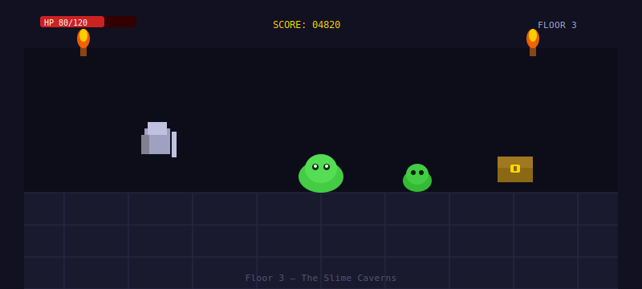

# Slime Dungeon

> **A fast-paced dungeon crawler where you battle hundreds of slimy enemies, collect cursed gear, and try not to die on floor 2.**

[Get Started](getting-started.md){ .md-button .md-button--primary }
[View Characters](guide/overview.md){ .md-button }

---

---

## What is Slime Dungeon?

Slime Dungeon is a **roguelike dungeon crawler** with procedurally generated levels, a cast of four very different characters, and an overwhelming slime problem. Each run is different. Most runs end badly. That's fine.

- 4 playable characters with unique abilities
- 10 floors of increasingly angry slimes
- Local co-op for up to 4 players
- Full permadeath (no saves, no mercy)
- Unlockable curses that make the game harder for fun

## At a glance

| Detail      | Info                        |
|-------------|-----------------------------|
| Genre       | Roguelike dungeon crawler   |
| Players     | 1–4 local co-op             |
| Platforms   | PC, Mac, Linux              |
| Difficulty  | Medium → Brutal             |
| Slime count | Way too many                |

> [!TIP] First time?
> Start with the **Knight**. Slow, tanky, forgiving. Save the Rogue for when you know what you're doing.
